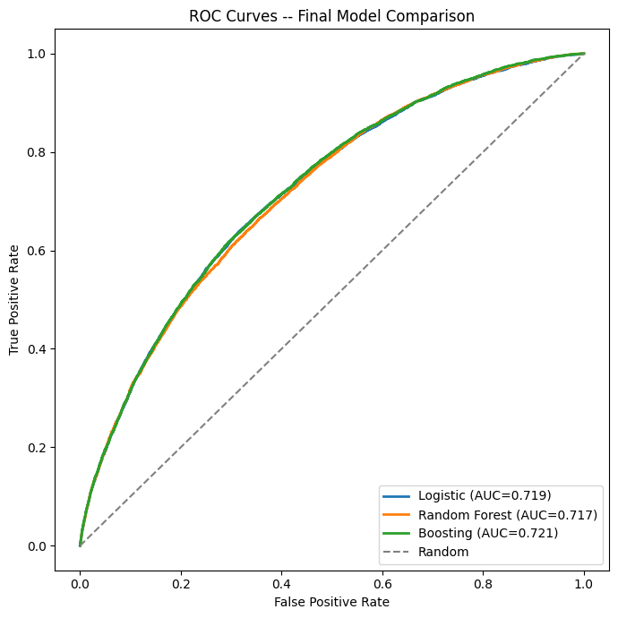

# Does Credit Risk Segmentation Actually Improve Prediction?

Author: **Bee (Avni)** — B.Stat/M.Stat, Indian Statistical Institute, Delhi Centre

A full investigation into a genuinely disputed question in credit risk modeling: does splitting borrowers into segments and building separate models per segment improve default prediction over a single, well-built global model — or has this long-standing practice been superseded by flexible machine learning that can already capture whatever heterogeneity exists in a population? Built on 1.34 million resolved LendingClub loans (2007–2018), using unsupervised segmentation (PCA + K-means) followed by a full supervised model comparison (logistic regression, LDA/QDA, ridge/lasso, Random Forest, boosting) to answer the question directly, empirically, and with formal statistical testing at every step.

## Repository Structure

```
├── README.md                          <- You are here
├── requirements.txt                    <- Python dependencies
├── notebooks/
│   └── borrower_segmentation.ipynb     <- Full analysis: cleaning, PCA, clustering, modeling, final test
└── images/
    └── roc_curve.png                   <- Final model comparison ROC curves
```

**Data**: this project uses the full LendingClub accepted-loans dataset (2007–2018Q4, 2.26 million rows). The raw data (392MB compressed) is not committed to this repository — see [Data Source](#data-source) below.

## Quick Links

- [Full Analysis Notebook](notebooks/borrower_segmentation.ipynb)

## Overview

Credit scoring has historically relied on segmenting borrower populations (prime vs. sub-prime, thin-file vs. thick-file) and building separate models per segment. Recent research disputes whether this still helps once flexible machine learning methods are available — one study found multi-scorecard models don't reliably beat a single scorecard; industry analysis argues a single model trained on a full population can transfer patterns a segment-specific model, working with a smaller slice of data, simply cannot see. This project tests the question directly on real data rather than assuming either side.

## Data Source

The full LendingClub "accepted loans" dataset, 2007–2018Q4, available via Kaggle: [`wordsforthewise/lending-club`](https://www.kaggle.com/datasets/wordsforthewise/lending-club). Download `accepted_2007_to_2018Q4.csv` and place it at `data/accepted_2007_to_2018Q4.csv` — the notebook processes the full 2.26M-row file in memory-efficient chunks from there.

## Methodology

### Part 1 — Data Cleaning and Unsupervised Segmentation

- **Target construction**: restricted to genuinely resolved outcomes only (`Fully Paid` / `Charged Off`), explicitly excluding ongoing, ambiguous, or non-standard-policy loans, with every exclusion justified rather than left implicit.
- **Leakage-safe feature selection**: every one of 151 raw columns was tested against a single rule — would this value have been knowable to a loan officer at the moment of the lending decision? Roughly 70 post-origination columns (payment history, hardship programs) were excluded on this basis.
- **A genuine missing-value investigation**: found and confirmed (via correlation-by-issue-year analysis) that a cluster of columns were missing not at random, but because LendingClub simply hadn't started collecting them yet — informative missingness was preserved via explicit indicator flags rather than naive imputation.
- **PCA + K-means clustering** (K=2, chosen via elbow/silhouette analysis) discovered two genuinely distinct borrower profiles — smaller-footprint/lower-income/higher-utilization vs. larger/higher-income/lower-utilization — validated for stability via bootstrap resampling (mean cluster-assignment agreement >95% across resamples).

### Part 2 — The Direct Test

A full classification comparison (logistic regression, LDA, QDA, ridge, lasso, Random Forest, HistGradientBoosting) was built first, using proper 5-fold cross-validation, before the actual segmentation question was tested: **does fitting separate models per cluster outperform one global model, evaluated on identically pooled predictions?**

The investigation was deliberately not accepted at face value on the first pass — every version of the test was stress-tested for real methodological gaps (an initial hyperparameter mismatch between the two arms, an unchecked overfitting risk, a subtle leakage issue in how clusters were assigned to the held-out test set) before being trusted.

## Key Findings

**A single global model is not robustly beaten by the segmented approach.** Across three independently rigorous versions of the comparison — a naive test, a corrected-for-fairness test, and a fully independent test-set confirmation — the global model stayed numerically ahead throughout, but the gap was only statistically significant in the least careful version of the test:

| Comparison | Global AUC | Segmented AUC | Statistical Significance |
|---|---|---|---|
| Naive (identical hyperparameters) | 0.7218 | 0.7190 | p = 0.014 (significant) |
| Rigorous (per-arm tuned) | 0.7226 | 0.7206 | p = 0.123 (not significant) |
| Final held-out test set | 0.7226 | 0.7203 | Bootstrap 95% CI excludes 0, but see note below |

*Note on the apparent tension in the last row: a bootstrap confidence interval on the test set (resampling which rows are evaluated, holding models fixed) found the gap statistically real — but this measures a different kind of uncertainty than the cross-validated test above (which resamples which data the models are trained on). Both are correct simultaneously: the difference is genuine for these specific fitted models, while its stability under retraining remains less certain. See the prep guide for the full explanation.*

**A deeper, genuinely important finding on final review: none of the more flexible methods tested provide a *confirmed* improvement over plain logistic regression.** Boosting had the highest point estimate throughout the project, but a direct statistical test found its advantage over logistic regression was not distinguishable from noise (95% CI includes 0), while its advantage over Random Forest was confirmed. This is consistent with an earlier finding that regularization (ridge/lasso) provided no benefit over unregularized logistic regression — strong, convergent evidence that the relationship between borrower features and default risk in this data is substantially linear.

**Permutation importance on the final model directly confirmed an earlier, independently-derived PCA finding**: a borrower's LendingClub-assigned sub-grade dominates every other feature by more than 3×, corroborating (from a fully supervised angle) an unsupervised PCA component that had already reconstructed LendingClub's own credit-grading logic from raw behavioral data alone.



## Tech Stack

`pandas` · `numpy` · `scikit-learn` · `scipy` · `matplotlib`

## Limitations

- Only one clustering solution (K=2) was tested for the segmentation comparison; whether a different number of segments changes the conclusion was not explored.
- The project deliberately stayed within standard, explainable methods throughout (no specialized mixed continuous/categorical clustering, no exhaustive hyperparameter search) given real computational constraints.
- Calibration was not assessed — a deliberate scope decision, since every metric used throughout is rank-based (AUC), which is unaffected by calibration; this project never used raw probability values for a threshold or pricing decision.

## Author

Built as part of a placement portfolio targeting quantitative research and data science roles.
